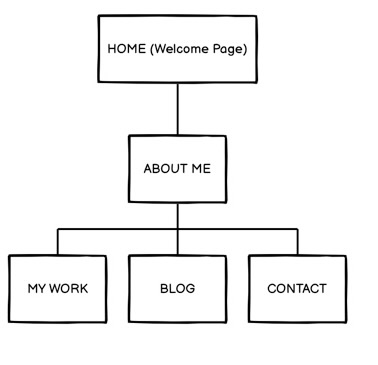

* Link to my Website: https://app.netlify.com/sites/anupkuriakoseportfolio/deploys
* Link to my GitHub Repo: https://github.com/Anup-SoftwareDev/Portfolio-Website
* Description of Website: The website is a Portfolio Website for Anup Kuriakose, a Software Developer.
* The purpose of this website is to to present , the skills, and the work done by Anup to potential employers/recruiters in the Software development field. It also serves to market Anup's skills to anybody else interested in working with him.
* The Site map for the Website is as follows:

* The Website has an Animated Welcome Page as shown below:

*It then goes to a AboutMe Page with basic information on Anup shown below:

*It also provides the following pages to show Anup's skills further:

The Website has also been made responsive using a hamburger menu for Mobiles as shown below:

* The Tech Stack is as shown in the image below:

